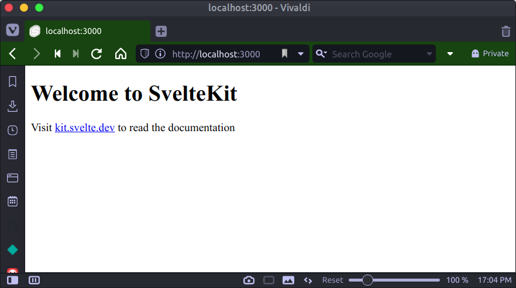
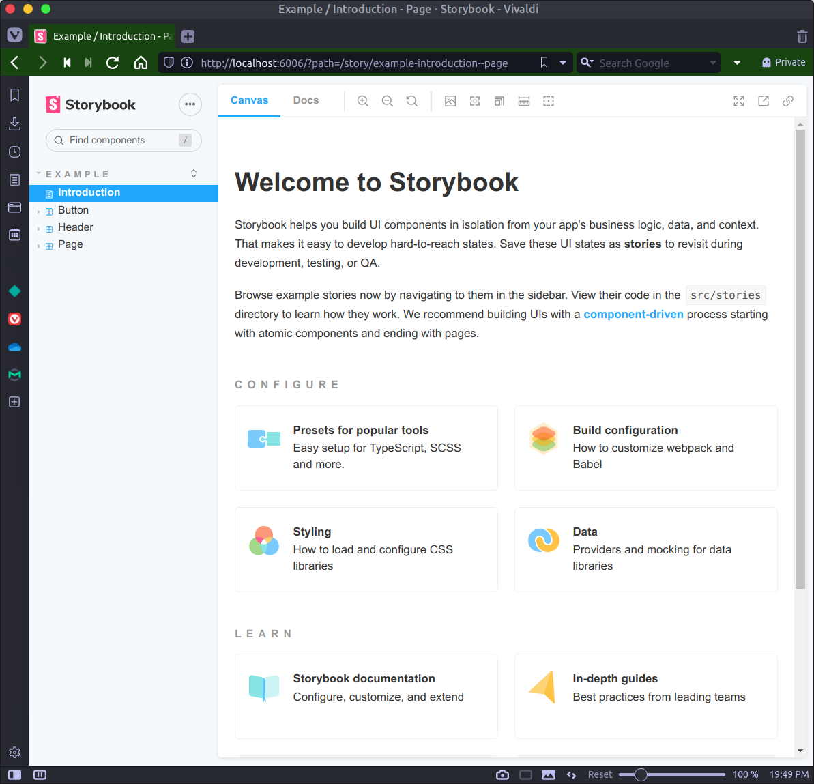

# Storybook with a Vite, Svelte & TailwindCSS setup

A working example of [Storybook](https://storybook.js.org/), with [Vite](https://vitejs.dev/), [Svelte Kit](https://kit.svelte.dev/) and [Tailwind CSS](https://tailwindcss.com/).


## Installation

```bash
git clone https://github.com/kematzy/storybook-svelte-kit-vite-app your-app-name

cd your-app-name

npm install

npm run storybook

```

<br>


## Details of Code setup

A step-by-step guide of how I made this work.

<br>

### 1. Initial SvelteKit installation

Follow the initial instructions on the [Svelte Kit page](https://kit.svelte.dev/).


```shell
npm init svelte@next your-storybook-vite-sveltekit-app
```

<br>

Choose the following setup options from those presented:

| Question                            | Choice                    |
|-------------------------------------|---------------------------|
| Which Svelte app template?          | **Skeleton project**      |
| Use TypeScript?                     | **No**                    |
| Add ESLint for code linting?        | **Yes**                   |
| Add Prettier for code formatting?   | **Yes**                   |

<br>

Further Reading:

- [Read Me - ESLint & Svelte](https://github.com/sveltejs/eslint-plugin-svelte3)

- [Prettier Formatting Options](https://prettier.io/docs/en/options.html)

- [Prettier - Svelte specific formatting options](https://github.com/sveltejs/prettier-plugin-svelte#options)


<br>


Change into your created directory and run `npm install` to install all packages:

```shell
cd your-storybook-vite-sveltekit-app

npm install
```

<br>

Optionally, create a Git repository and commit all the changes.

```shell
git init

git add -A

git commit -m "Initial commit"
```

<br>

Run some quick tests to ensure things are working.

```shell
npm run dev -- --open
```

<br>




<br>

### 2. Add TailwindCSS support

Install [Tailwind CSS](https://tailwindcss.com/) support based upon their general instructions.

```shell
npm install -D tailwindcss@latest postcss@latest autoprefixer@latest
```

<br>

Add additional PostCSS packages for better CSS formatting.

```shell
npm install -D postcss-import postcss-nesting
```

- `postcss-import` supports multiple CSS files
- `postcss-nesting` supports nested CSS format

<br>

Add support for parallel CSS generation.

```shell
npm install -D postcss-cli concurrently cross-env
```

<br>

Create a **postcss.config.cjs** with the following contents:

```js
module.exports = {
  plugins: {
    'postcss-import': {},
    'postcss-nesting': {},
    tailwindcss: {},
    autoprefixer: {},
  },
}
```

<br>

Add the Tailwind config file:

```shell
npx tailwindcss init tailwind.config.cjs
```

<br>

Then update **tailwind.config.cjs** with **JIT** and purge settings:

```js
module.exports = {
  // ...
  mode: 'jit',
  purge: ['./src/**/*.svelte'],
  // ...
}
```

Create **src/styles/tailwind.css** with the following contents:

```css
/* Injects Tailwind's base styles & any base styles registered by plugins. */
@tailwind base;

@layer base { /* custom CSS goes here */ }

/* Injects Tailwind's component classes & any component classes registered by plugins. */
@tailwind components;

@layer components { /* custom CSS goes here */ }

/* Injects Tailwind's utility classes & any utility classes registered by plugins. */
@tailwind utilities;

@layer utilities { /* custom CSS goes here */ }

/* Directive controlling where Tailwind injects responsive variations of utilities.
   By default Tailwind normally append these at the end of your stylesheet. */
@tailwind screens;
```


Then update the _script_ section in **package.json** as follows:

```json
{
  "scripts": {
    "dev:only": "svelte-kit dev",

    "build:only": "svelte-kit build",

    "preview": "svelte-kit preview",

    "tailwind:watch": "cross-env TAILWIND_MODE=watch cross-env NODE_ENV=development  postcss src/styles/tailwind.css -o static/app.css -w",

    "tailwind:build": "cross-env TAILWIND_MODE=build cross-env NODE_ENV=production  postcss src/styles/tailwind.css -o static/app.css",

    "dev": "concurrently \"npm run dev:only\" \"npm run tailwind:watch\"",

    "build": "npm run tailwind:build && npm run build:only",

    // other defined scripts
  },
}
```

<br>


Update the **src/routes/index.svelte** with Tailwind classes and import the **src/styles/tailwind.css** file for Vite hot reloading.

```html
<script>
  import "../styles/tailwind.css";
</script>


<div class="flex flex-col justify-center align-middle p-4 mb-12">
  <h1 class="text-4xl text-center text-purple-700 font-light">Welcome to SvelteKit</h1>

  <p class="text-center mb-4 mt-2">
    Visit
    <a
      class="text-purple-400 hover:text-pink-700 hover:underline"
      href="https://kit.svelte.dev"
    >
      kit.svelte.dev
    </a>
    to read the documentation.
  </p>
</div>
```

<br>
<br>

### 3. Add StyleLint support

Install `stylelint` related packages to silence any errors and/or warnings in your code editor.

```shell
npm install -D stylelint stylelint-config-standard stylelint-config-recommended
```
<br>

Create a **stylelintrc.json** file with the following contents:

```json
{
  "extends": [
    "stylelint-config-recommended"
  ],
  "processors": [],
  "rules": {
    "at-rule-no-unknown": [
      true,
      {
        "ignoreAtRules": [
          "tailwind",
          "apply",
          "variants",
          "responsive",
          "screen",
          "function",
          "each",
          "if",
          "else",
          "return",
          "layer"
        ]
      }
    ],
    "declaration-block-trailing-semicolon": null,
    "no-descending-specificity": [
      true,
      {
        "ignore": [
          "selectors-within-list"
        ]
      }
    ],
    "no-invalid-double-slash-comments": true,
    "block-no-empty": null
  }
}
```

<br>

**Optional**: If you are using VS Code, then add a `.vscode/settings.json` file with the following settings:


```json
{
  "css.validate": false,
  "less.validate": false,
  "scss.validate": false,
  "postcss.validate": false,
  "files.associations": {
    "*.css": "postcss"
  },
  "editor.formatOnSave": false,
  "editor.codeActionsOnSave": {
    "source.fixAll.eslint": true,
    "source.fixAll.html": true
  },
  "stylelint.enable": true,
  "stylelint.validate": [
    "css",
    "postcss"
  ],
  "typescript.disableAutomaticTypeAcquisition": true,
  "javascript.format.enable": false
}
```

<br>

--------

Run some quick tests to ensure the Tailwind implementation is working.

```shell
npm run dev -- --open
```

<br>


<br>

--------

<br>

If you created a Git repository already, then this is a great time to commit all the changes.

```shell
git add -A  && git commit -m "Added Tailwind, PostCSS & Stylelint support"
```

--------

<br>
<br>

###  4. Install and Setup Storybook

So far things have been fairly straightforward and hopefully without any errors.

Follow the instructions in the [Storybook's Svelte Getting Started](https://storybook.js.org/docs/svelte/get-started/install) and run:


```shell
npx sb init
```

<br>

And you will see output similar to this:

```bash
npx sb init

 sb init - the simplest way to add a Storybook to your project.

✓ Detecting project type.
info Configuring preprocessor from 'svelte.config.js'

added 1357 packages, and audited 2102 packages in 33s

✓ Preparing to install dependencies.
  up to date, audited 2102 packages in 2s

✓ To run your Storybook, type:

   npm run storybook

For more information visit: https://storybook.js.org
```

<br>

Try to start Storybook in development mode:

```shell
npm run storybook
```

<br>

At this point **you will very likely hit a number of errors** along these lines:


```shell
npm run storybook

> ~TODO~@0.0.1 storybook
> start-storybook -p 6006

info @storybook/svelte v6.3.6
info
ERR! Error [ERR_REQUIRE_ESM]: Must use import to load ES Module: [$HOME]/DEV/your-storybook-vite-sveltekit-app/.storybook/main.js
ERR! require() of ES modules is not supported.
ERR! require() of [$HOME]/DEV/your-storybook-vite-sveltekit-app/.storybook/main.js from [$HOME]/DEV/your-storybook-vite-sveltekit-app/node_modules/@storybook/core-common/dist/cjs/utils/interpret-require.js is an ES module file as it is a .js file whose nearest parent package.json contains "type": "module" which defines all .js files in that package scope as ES modules.
ERR! Instead rename main.js to end in .cjs, change the requiring code to use import(), or remove "type": "module" from [$HOME]/DEV/your-storybook-vite-sveltekit-app/package.json.
ERR!
ERR!     at Object.Module._extensions..js (internal/modules/cjs/loader.js:1080:13)
ERR!     at Module.load (internal/modules/cjs/loader.js:928:32)
ERR!     at Function.Module._load (internal/modules/cjs/loader.js:769:14)
ERR!     at Module.require (internal/modules/cjs/loader.js:952:19)
ERR!     at require (internal/modules/cjs/helpers.js:88:18)
ERR!     at interopRequireDefault ([$HOME]/DEV/your-storybook-vite-sveltekit-app/node_modules/@storybook/core-common/dist/cjs/utils/interpret-require.js:64:16)
ERR!     at serverRequire ([$HOME]/DEV/your-storybook-vite-sveltekit-app/node_modules/@storybook/core-common/dist/cjs/utils/interpret-require.js:101:10)
ERR!     at getPreviewBuilder ([$HOME]/DEV/your-storybook-vite-sveltekit-app/node_modules/@storybook/core-server/dist/cjs/utils/get-preview-builder.js:25:55)
ERR!     at buildDevStandalone ([$HOME]/DEV/your-storybook-vite-sveltekit-app/node_modules/@storybook/core-server/dist/cjs/build-dev.js:99:71)
ERR!     at async buildDev ([$HOME]/DEV/your-storybook-vite-sveltekit-app/node_modules/@storybook/core-server/dist/cjs/build-dev.js:154:5)
ERR!  Error [ERR_REQUIRE_ESM]: Must use import to load ES Module: [$HOME]/DEV/your-storybook-vite-sveltekit-app/.storybook/main.js
ERR! require() of ES modules is not supported.
ERR! require() of [$HOME]/DEV/your-storybook-vite-sveltekit-app/.storybook/main.js from [$HOME]/DEV/your-storybook-vite-sveltekit-app/node_modules/@storybook/core-common/dist/cjs/utils/interpret-require.js is an ES module file as it is a .js file whose nearest parent package.json contains "type": "module" which defines all .js files in that package scope as ES modules.
ERR! Instead rename main.js to end in .cjs, change the requiring code to use import(), or remove "type": "module" from [$HOME]/DEV/your-storybook-vite-sveltekit-app/package.json.
ERR!
ERR!     at Object.Module._extensions..js (internal/modules/cjs/loader.js:1080:13)
ERR!     at Module.load (internal/modules/cjs/loader.js:928:32)
ERR!     at Function.Module._load (internal/modules/cjs/loader.js:769:14)
ERR!     at Module.require (internal/modules/cjs/loader.js:952:19)
ERR!     at require (internal/modules/cjs/helpers.js:88:18)
ERR!     at interopRequireDefault ([$HOME]/DEV/your-storybook-vite-sveltekit-app/node_modules/@storybook/core-common/dist/cjs/utils/interpret-require.js:64:16)
ERR!     at serverRequire ([$HOME]/DEV/your-storybook-vite-sveltekit-app/node_modules/@storybook/core-common/dist/cjs/utils/interpret-require.js:101:10)
ERR!     at getPreviewBuilder ([$HOME]/DEV/your-storybook-vite-sveltekit-app/node_modules/@storybook/core-server/dist/cjs/utils/get-preview-builder.js:25:55)
ERR!     at buildDevStandalone ([$HOME]/DEV/your-storybook-vite-sveltekit-app/node_modules/@storybook/core-server/dist/cjs/build-dev.js:99:71)
ERR!     at async buildDev ([$HOME]/DEV/your-storybook-vite-sveltekit-app/node_modules/@storybook/core-server/dist/cjs/build-dev.js:154:5) {
ERR!   code: 'ERR_REQUIRE_ESM'
ERR! }

WARN Broken build, fix the error above.
WARN You may need to refresh the browser.

```

<br>

--------

If you created a Git repository already, then this is another great time to commit all the changes added before we make the necessary changes.

```shell
git add -A
git commit -m "Added Storybook support (default with errors)"
```

--------

<br>

To fix these errors we need to update the installed `@storybook` packages to version **^6.4.0-alpha.22 or later**.

I recommend removing the existing `node_modules` folder and `package-lock.json` from your project folder.

```shell
rm -rf node_modules

rm package-lock.json
```

<br>

And then update the following packages in the `package.json` file to the latest version.

```json
{
  // snip
  "devDependencies": {
    "@storybook/addon-actions": "^6.4.0-alpha.22",
    "@storybook/addon-essentials": "^6.4.0-alpha.22",
    "@storybook/addon-links": "^6.4.0-alpha.22",
    // snip
  },
  // snip
}
```

> **NOTE!**
>
> IF you try to update the `"@storybook/svelte` package to `^6.4.0-alpha.22` you will run into installation errors
> so we leave it at the default for now.

<br>
<br>

Re-install all the npm packages again.

```shell
npm install
```

<br>

The we need to install **@storybook/addon-docs** package that is missing:

```shell
npm install -D @storybook/addon-docs@6.4.0-alpha.22
```

<br>

While we are installing packages, we also need to install the **storybook-builder-vite** package to make the Vite actually stuff work:


```shell
npm install -D storybook-builder-vite
```

<br>

Then we need to rename _svelte.config.js_ to **svelte.config.cjs**...


```shell
mv svelte.config.js svelte.config.cjs
```

and convert the format as follows:

```js
/** @type {import('@sveltejs/kit').Config} */
module.exports = {
  config: {
    kit: {
      // hydrate the <div id="svelte"> element in src/app.html
      target: '#svelte',
    },
  },
}
```

<br>


As well as rename _.storybook/main.js_ to **.storybook/main.cjs**...

```shell
mv .storybook/main.js .storybook/main.cjs
```


and convert the format as follows:

```js
module.exports = {
  // NOTE! added support for Vite builder
  core: {
    builder: "storybook-builder-vite"
  },
  stories: [
    "../src/**/*.stories.mdx",
    "../src/**/*.stories.@(js|jsx|ts|tsx|svelte)"
  ],
  addons: [
    "@storybook/addon-links",
    "@storybook/addon-essentials",
    "@storybook/addon-svelte-csf"
  ],
  svelteOptions: {
    preprocess: require("../svelte.config.cjs").preprocess
  }
}
```
<br>

> **NOTE!**
>
> The added support for Vite through the following added code snippet:

```js
core: {
  builder: "storybook-builder-vite"
}
```

<br>

And then, finally, we need to just rename _.storybook/preview.js_ to **.storybook/preview.cjs** and not change the contents:

```shell
mv .storybook/preview.js .storybook/preview.cjs
```

<br>

--------

<br>

If you created a Git repository already, then this is another great point in time to commit all the changes.

```shell
git add -A  && git commit -m "Fixed Storybook errors"
```

--------

<br>
<br>


###  5. Start Storybook again

If you have followed the above instructions everything should work when you start Storybook again:

```shell
npm run storybook
```

<br>



<br>


## Found something wrong?

Open a PR if anything is wrong or things can be done in a better and faster way.


<br>
<br>

----------------

<br>

## SOURCES OF INFORMATION

- [Svelte Kit & Tailwind CSS Setup](https://levelup.gitconnected.com/how-to-use-svelte-kit-with-tailwind-css-jit-just-in-time-compilation-bc04c0c9ec17)

- [Storybook for Vite - Lightning-fast development with native ES Modules](https://storybook.js.org/blog/storybook-for-vite/)

- [Storybook builder for Vite](https://github.com/eirslett/storybook-builder-vite)

- [TailwindCSS - Functions & Directives](https://tailwindcss.com/docs/functions-and-directives#tailwind)


## Developing

Once you've created a project and installed dependencies with `npm install` (or `pnpm install` or `yarn`), start a development server:

```bash
npm run dev

# or start the server and open the app in a new browser tab
npm run dev -- --open
```

## Building

Before creating a production version of your app, install an [adapter](https://kit.svelte.dev/docs#adapters) for your target environment. Then:

```bash
npm run build
```

> You can preview the built app with `npm run preview`, regardless of whether you installed an adapter. This should _not_ be used to serve your app in production.
